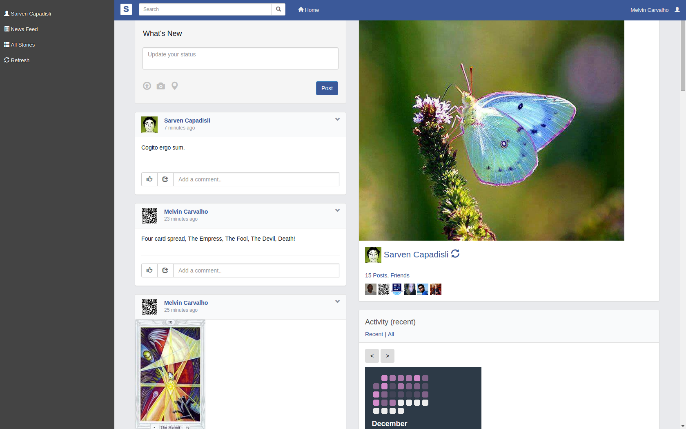
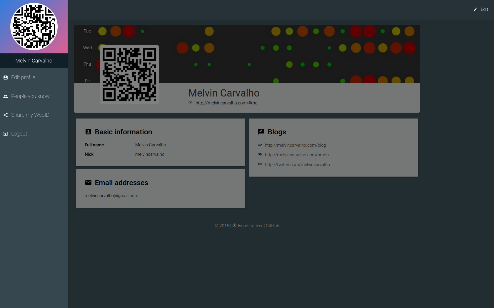
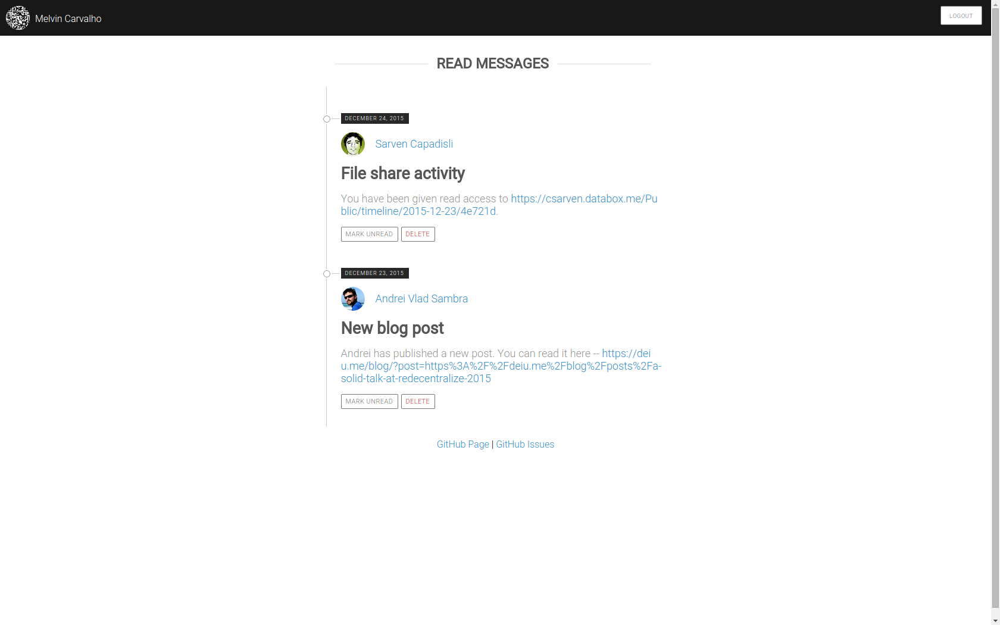

Solid Social
=======

[solid.social](https://solid.social/) is the first decentralized social network built in the style of the web.  It is 100% owned by its users.

The code is free and open source software under MIT license.

This book is a stub.  Please help improve this documentation by forking the gitbook and adding content!

* Decentralized Social Networking
* Store your own data
* Profile management
* Status updates
* Liking posts
* Commenting on posts
* Decentralized social graph
* Adding friends and friend requests
* Inbox
* Search
* Tagging
* Image upload
* Instant messaging
* Semantic Inbox
* Privacy control on all data
* Open ended access to data
* App platform
* Web payments
* 100% compliant with Open W3C Standards

# Gallery

